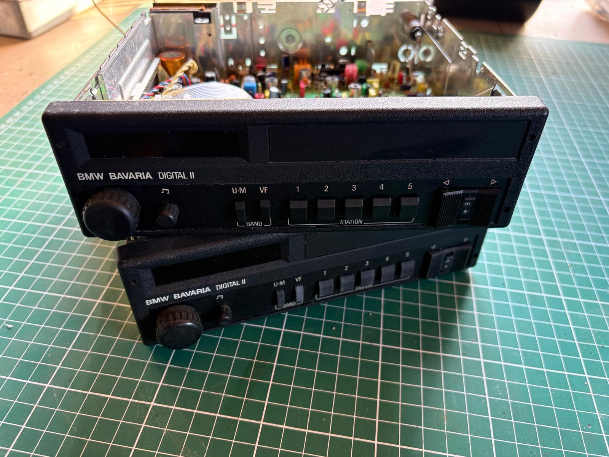
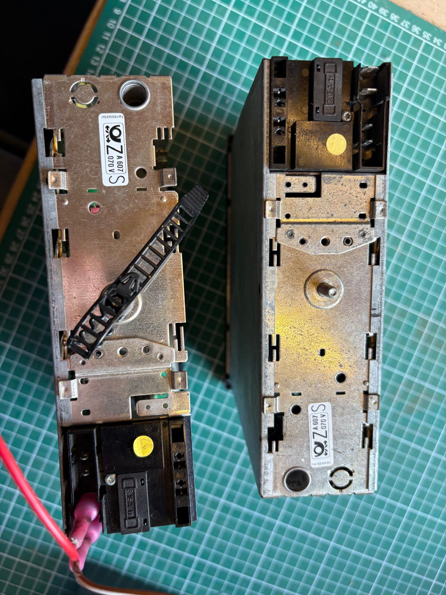
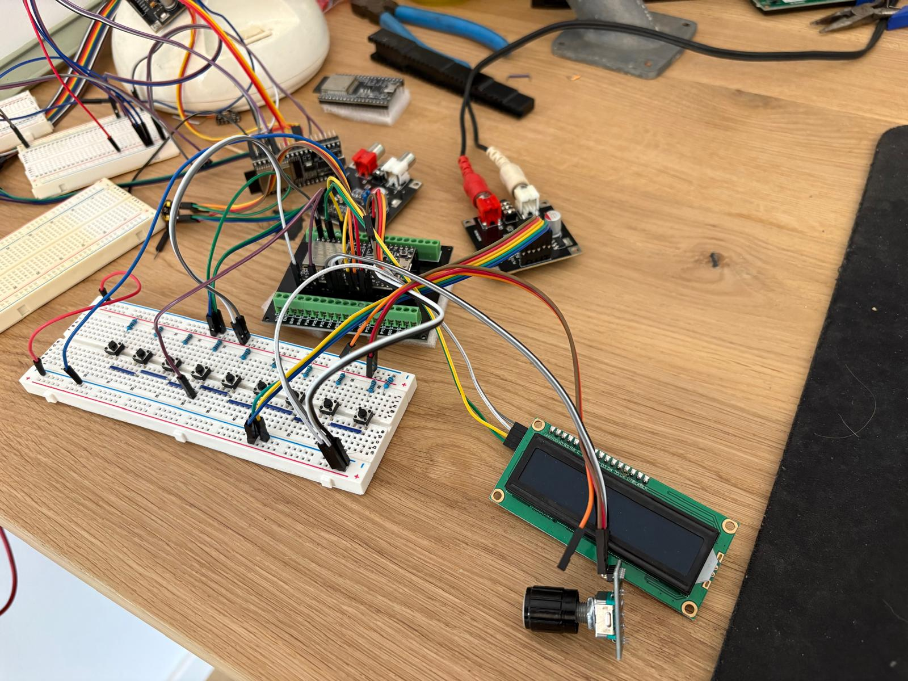

# CAR Stereo

**Turning a BMW Bavaria Digital II into a modern radio**

## Features

### Audio Streaming (A2DP)
- High-quality Bluetooth audio sink
- Automatic connection handling

### Phone Calls (HFP)
- **Call Control**: Answer, reject, hang up calls
- **Dialing**: Direct dial, redial, speed dial
- **Voice Recognition**: Trigger Siri/Google Assistant
- **Volume Control**: Adjust speaker and microphone volume
- **Phone Queries**: Get operator, call list, own number
- **Advanced Features**: BTRH, XAPL, iPhone battery reporting

### Music Control (AVRC)
- Play/pause control
- Track navigation (next/previous)
- Track metadata (title, artist, album)
- Playback status notifications

### Contact Sync (PBAP)
- Automatic phonebook download
- Contact storage to SPIFFS
- Country code support for formatting

### FM/DAB+ Radio
- Switching between FM/DAB
- Store 5 favorite stations (DAB and FM)
- Prev/Next station

### Hardware

<table>
<tr>
<td> <b>BMW Bavaria Digital II</b></td>
<td> <b>PCM5102 DAC</b></td>
<td> <b>Complete Setup</b></td>
</tr>
</table>

### Software

I wrote 2 Esp Idf components; 
- [a2dpSinkHfpClient](https://github.com/walinsky/a2dpSinkHfpClient)
- [SI4684](https://github.com/walinsky/SI4684)

a2dpSinkHfpClient for handling all bt audio (streaming and phone calls), and SI4684 for controlling the DAB/FM receiver.

car_stereo itself is mainly a state machine, handling the events from a2dpSinkHfpClient, SI4684 and of course the buttons

## Rationale

I have a >40 year old car; and I want to have a period correct looking stereo.

However; I also want to use all modern features we are used to have at hand.

### Status

WIP

## License

MIT License - see [LICENSE](LICENSE) file for details.

## Contributing

Contributions are welcome! Please:
1. Fork the repository
2. Create a feature branch
3. Make your changes
4. Submit a pull request

## Author

walinsky

